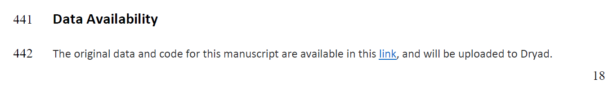

Hello peeps!

Welcome to the Shareable Data lab workshop. 

In these two sessions, we will get familiar with Github and RMarkdown so we could share our code and include the visualisation of your data along with your paper upon journal submission!

# Objective

<br>

To produce readable and beautiful code + convert it into an HTML website + put a link in your manuscript.  

Example:

```{r, echo = FALSE, out.width = '100%'}

```

Link = https://lospinarozo.github.io/PrettyCoolBeetlesCodeAndData/ 


# Rationale

Why is it useful to include a link to your code in your manuscript from the first time you submit? 

1) Best way to make your science more transparent  

2) You can make your science more accessible to other scientists  

3) Your reviewers have easy access to your code. This is useful for them to understand your rationale and stats  

4) Even if you have to make changes to your code, the link remains the same. And you will always have a history of the changes.  

5) The most important reason: To really show your work!!!  

The paper is just the tip of the iceberg, what about those thousands  lines of code you had to do to get there? Do not let them go unnoticed!


# Let's get to it!

1. [Workshop 1: Github](workshopGithub.html) 

1. [Workshop 2: RMarkdown](workshopRMarkdown.html) 
