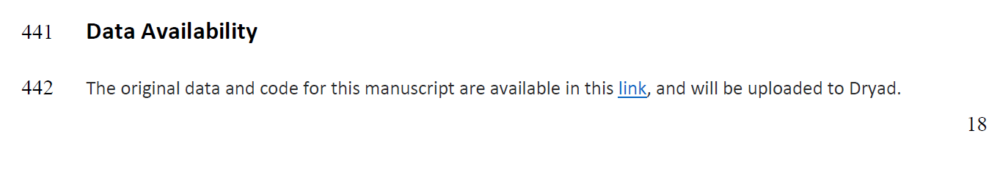
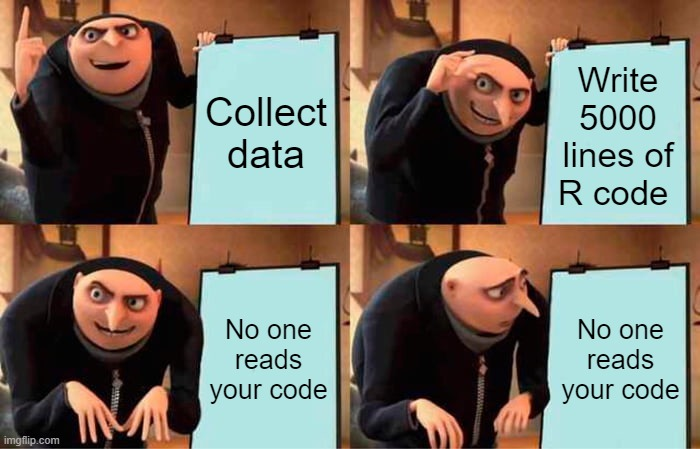

Hello peeps!

Welcome to the Shareable Data lab workshop. 

In these two sessions, we will get familiar with Github and RMarkdown so we could share our code and include the visualisation of your data along with your paper upon journal submission!

# Objective

<br>

To produce readable and beautiful code + convert it into an HTML website + put a link in your manuscript.  

Example:

```{r, echo = FALSE, out.width = '100%'}

```

Link = https://lospinarozo.github.io/PrettyCoolBeetlesCodeAndData/ 

<br>
<br>
<br>

# Rationale

<br>

Why is it useful to include a link to your code in your manuscript from the first time you submit? 

<br>

1) Best way to make your science <span style="color: #f6781d">**more transparent**</span> 

<br>

2) You can make your science more <span style="color: #00a68d">**accesible**</span> to other scientists  

<br>

3) <span style="color: #db9622">**Your reviewers can see**</span> your code. This is useful for them to understand the rationale for your stats  

<br>

4) When you make changes to your code, <span style="color: #26bed9">**The link remains the same**</span> but readers can see the version history.  

<br>

5) The most important reason: to really <span style="color: #da0728">**Show your work**</span>

<br>
<br>
<br>

```{r, echo = FALSE, out.width = '100%'}

```

<br>
<br>

The paper is **just the tip of the iceberg**, what about those thousands  lines of code you had to do to get there? Here are some tips so they do not go unnoticed!

<br>
<br>

# Let's get to it!

<br>
<br>

1. [Workshop 1: Github](workshopGitHub.html) 

1. [Workshop 2: RMarkdown](workshopRMarkdown.html) 
