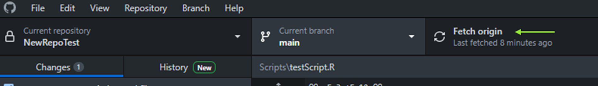

Change test
Workshop 1 - Getting Familiar with GitHub

# A General Comment

There are many ways to do the same thing in GitHub, we will give you our favourite (easy + fast), but you can explore others if you want. 


# Terminology 
<br>
<br>
__Repository__: One project. It can contain multiple scripts and data sets.  

<br>
__Clone__: Copy a repository to your computer so you can work on it.  

<br>
__Template__: A repository that contains useful code. You can clone it and modify it for your own project. Even if you clone a repository, the changes will not affect the original.


<br>
__Push__: Upload your change sin GitHub.  

<br>
__Pull__: Download any changes you (or anybody else) did in a repository you have already cloned. i.e. Download form the internet to your computer.  

<br>
<br>
<br>

# Setting up

1. Open an account in GitHub: https://github.com/signup?source=login 
2. Download GitHub desktop App: https://desktop.github.com/ 
3. Link your desktop app to your GitHub account:

Open GitHub desktop and click sign in to GitHub.com:

```{r, echo = FALSE, out.width = '100%'}

```

Then, introduce your log in details if the app asks for them (if you are already logged in in your browser, the app would probably fill everything automatically). Then, authorize the application to open with GitHub Desktop. 

The following window will pop up: 

```{r, echo = FALSE, fig.cap = "click finish", out.width = '100%'}

```

4. Request access to the Lab organization: “bugoftheweek”

Once you have completed these steps, send your GitHub username and email address to amandaf@unimelb.edu.au so that we can invite you the lab organization: “bugoftheweek”.

<br>
<br>
<br>
<br>

# Three different situations to use Git-Hub

<br>
<br>
<br>

## Scenario 1: Your Code

<br>

Upload a repository that you created on your own GitHub account.

<br>

_This scenario will be useful if you already have a project for one of your papers and want to share your code with the world._

<br>

### 1.1. Project

Go to R studio and assign a project to your script
Note: You may have already assigned a project, if at the beginning, you started by creating a new project instead of just a new script. 

```{r, echo = FALSE, fig.cap = "In the upper right corner click in the arrow to display the dropdown menu. Click on “New Project”.", out.width = '50%'}

```

```{r, echo = FALSE, fig.cap = "Follow the prompts: New directory – New Project -Add name and location", out.width = '50%'}

```

Note: Do not select “create a git repository”. It is possible to do it this way, but it is longer. And click “Accept”. 

<br>
<br>

### 1.2. Repo

Create a new repository from GitHub Desktop

```{r, echo = FALSE, fig.cap = "Open GitHub Desktop", out.width = '100%'}

```

```{r, echo = FALSE, fig.cap = "Both paths will lead to this pop up", out.width = '50%'}

```

```{r, echo = FALSE, fig.cap = "Choose the directory where you have your project. And click on “create repository”. Then this windwo will appear", out.width = '75%'}

```

```{r, echo = FALSE, fig.cap = "Next, your app would look like this", out.width = '100%'}

```

Click publish repository, and that is it! It will be uploaded to your GitHub. 

<br>
<br>

### 1.3. Push

Push your local changes to GitHub

Any time you make changes in your code in your local folder, they will appear on the left-hand panel. When you are ready, write a small summary and description of your changes so that people know why this was required and then push them to GitHub by selecting “Commit to main”

```{r, echo = FALSE, fig.cap = "Next, your app would look like this", out.width = '100%'}

```


<br>
<br>

### 1.4. Local Work

Continue working on your file

From now on, it will be super easy to upload your local changes to your GitHub.com. Just hit “commit to main” after you are happy with your changes.

__Important!!!__ Always pull origin before start working on any repository. In this way you first download the latest version online, then combine that with your local changes. Here is an example: 

```{r, echo = FALSE, fig.cap = "Always click “fetch origin” before making any changes in your local file.", out.width = '100%'}

```

```{r, echo = FALSE, fig.cap = "After clicking “fetch origin”, the desktop app detected that there were two changes online, so you need to select “Pull origin” and then work on that last version.", out.width = '100%'}

```

<br>
<br>

### 1.5. Resolve conflicts

_This is a parenthesis for troubleshooting_  

<br>

It can happen that you and your collaborator worked on the file at the same time. In this case, you would need to commit your changes, then pull and then resolve the mismatches selecting what to keep. However, this is a bit more complicated. One option is to type this line in your console: 

```{r, echo = FALSE, out.width = '100%'}

```

GitHub Desktop will ask you if you want to open with R. Say yes, and it will show you the conflicts.

```{r, echo = FALSE, out.width = '100%'}

```

Resolve the conflicts, save the file and push to your GitHub. Hopefully that is not necessary

_End of troubleshooting_

<br>
<br>

### 1.6. Track

Click on “Fetch Origin” and then “History” to see the changes from your collaborators or the ones you did on your GitHub.com

```{r, echo = FALSE, out.width = '100%'}

```

And when you open the file in your computer you can be sure all the merging has been done automatically and your file has all the remote changes already included. 😊 

<br>
<br>
<br>

## Scenario 2: Templates

<br>

Use a template repository from “bugoftheweek” 

<br>

_This scenario will be useful if you are new to a topic and want to use already existent code to apply to your project. We have got your back!_

<br>

### 2.1. Choose template

Got to your GitHub.com. By this time you probably have been added to “bugoftheweek”. On the left-hand panel, under your profile photo, find the title “Organizations” and click on the picture.
We have divided the repositories according to your topics of interest. Click on the one you need, and then click on the button “Use this template”.

```{r, echo = FALSE, out.width = '100%'}

```

```{r, echo = FALSE, fig.cap = "You will see this screen", out.width = '100%'}

```

(Note: this is an example from another repository, Statistics)
Make sure you change the “owner” to your own username. Add a name for this repository and click “Create repository from template”

<br>
<br>

### 2.2. Clone 

Clone this template to work on it from your computer

Go to GitHub desktop. Select File - Clone repository -  Select the one you want to work on and indicate the folder on your computer where you want to send it to. 

```{r, echo = FALSE, out.width = '80%'}
knitr::include_graphics("../images/figure 17.png")
```

```{r, echo = FALSE, out.width = '80%'}

```

For this example, notice that this repository is already on my GitHub since it has my username/the name I gave it. This ensures that when you clone a template you won’t modify the original. 
That’s it! Now it is all yours. You can start working on it normally, and when you are happy with your changes you can commit to main and it will be saved in your GitHub.com. It will be saved as a public file which is great to share your code with reviewers or peer scientists. 

<br>
<br>

### 2.3. Share!

One last bit to return knowledge to your dear lab-mates

Did you notice that all our repositories have a README file attached?

```{r, echo = FALSE, out.width = '100%'}

```

After you have used one of the “bugoftheweek” templates, do not forget to click on the pencil (upper right corner) to add your name, date in which you used it and the link to your modified repository in your own GitHub.com account. You can also add a one sentence description of big adaptations you needed for your project. In this way, your lab-mates can not only use the basic template but also see how it looks its implementation in real-life projects. It is particularly helpful if someone needs to use a particular adaptation you did to the template. 

<br>
<br>
<br>

## Scenario 3: Edit Templates

<br>

Modify a template repository and upload to “bugoftheweek”

<br>

_This scenario will be useful if you realize you want to contribute to our common knowledge and produce more templates for your fellow lab-mates._

<br>

Before doing this, please discuss with Amanda. Ideally, we do not want to change the templates too much, only when we identify there is a mistake that needs to be amended, or we want to add a new script.

<br>

### 3.1 Clone

Clone the template from the organization to work on it from your computer

Go to GitHub desktop. Select File - Clone repository -  Select the one you want to work on and indicate the folder on your computer where you want to send it to. 

```{r, echo = FALSE, out.width = '80%'}

```

Notice that in this case, the repository still belongs to “bugoftheweek”. Select the folder you want to save it to. 

<br>
<br>

### 3.2 Modify 

Work on the scripts normally and then push your changes by selecting “commit to main”. The original template will be updated. 

<br>
<br>
<br>


-----------------

Annnnnd this is how we conclude this brief introduction to GitHub. 

We hope you find it useful! 

