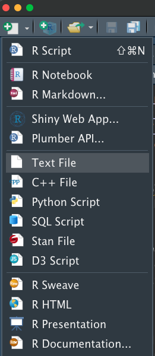
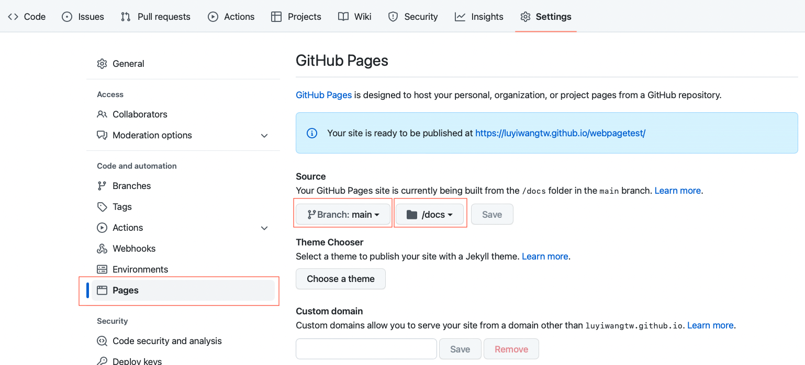

Workshop 2 - RMarkdown

# The aim 

We want to present the results and the visuals in ways that are easier to share with people. We will knit the RMarkdown file into a PDF or a webpage, so people can have all the info in one place (together with the code if it is a webpage).

# What is RMarkdown?

RMarkdown is a file format to make dynamic documents in R. You can include 
analyses with outputs, graphs, text to explain your analysis, photos and 
hyperlinks. This page you are looking at right now is produced from an 
RMarkdown file! The RMarkdown file consists of text and chunks of code. This 
allows you to provide formatted explanations alongside your code and analysis.

Check out [these](https://luyiwangtw.github.io/BugoftheweekWorkshop/workshopRMarkdown.html#Useful_links) useful links (below) to learn more.

# Structure 
As we have mentioned in the last workshop (or not), we suggest you to have some specific folders to keep everything tidy.

* data: your data
* scripts: for the scripts, including .R and .Rmd files
* docs: for the output
* images (optional): for the images 

# Knit into html

We will use RMarkdown to create a webpage and publish the page as a GitHub page online.

example 1 - [Visual models](https://luyiwangtw.github.io/LongWavelengthSensitivity/)

example 2 - [Heating rate](https://lospinarozo.github.io/PrettyCoolBeetlesCodeAndData/)

```{r xaringanExtra-clipboard, echo=FALSE}
library(xaringanExtra)
htmltools::tagList(
  xaringanExtra::use_clipboard(
    button_text = "<i class=\"fa fa-clipboard\"></i>",
    success_text = "<i class=\"fa fa-check\" style=\"color: #90BE6D\"></i>",
  ),
  rmarkdown::html_dependency_font_awesome()
)

```

## Details {.tabset .tabset-fade .tabset-pills}

Let's take a closer look what we can have in a website

### 1. Header 

```{r, echo = FALSE, out.width = '100%'}
knitr::include_graphics("../images/header.png")
```

### 2. Table
```{r, echo = FALSE, out.width = '100%'}
knitr::include_graphics("../images/float toc.png")
```

### 3. Tabs
```{r, echo = FALSE, out.width = '100%'}
knitr::include_graphics("../images/tabs.png")
```

### 4. Code button
```{r, echo = FALSE, out.width = '100%'}
knitr::include_graphics("../images/show code.png")
```

## Essentials Files 
There are two files you need with the exact same file names to publish a webpage:

1. index.html: default homepage
2. _site.yml:  essential **if** you want to have **more than one page** on your site. It provides the global YAML header for the site. 

Note: If you want only one page like [this example](https://lospinarozo.github.io/PrettyCoolBeetlesCodeAndData/), you only need index.html and do not need the _site.yml. But remember that you need to set the appearance in the yaml header of the index.Rmd because you do not have the _site.yml in this case.


<span style="color: #FF8F00">**Exercise 1**: Copy the [Website repo](https://github.com/bugoftheweek/Webpage/tree/main) from Bug of the week to your own GitHub. 

### html

#### Content page
You can create RMarkdown files and set the output into html format. <br> 
Where to set it? <br>
You will set the output formate and appearance in the yaml header of your RMarkdown file.<br>
What and where is the yaml header?<br>
In (very) short, it controls the overall appearance of the page and it is on the top of the file like this:<br>

```{r eval=FALSE, include=TRUE}
---
title: "Workshop 2: RMarkdown"
author: "Amanda Franklin, Laura Ospina, Lu-Yi Wang"
date: "4/25/2022"
output: html_document
knit: (function(inputFile, encoding) {
  rmarkdown::render(inputFile, encoding = encoding, output_dir = "../docs") })
---
```

_See [here](https://stats.oarc.ucla.edu/stat/data/rmarkdown/rmarkdown_seminar_flat.html#elements-of-an-r-markdown-file---yaml-header) and [here](https://stats.oarc.ucla.edu/stat/data/rmarkdown/rmarkdown_seminar_flat.html#yaml-header) for more details about yaml._


_Note: You would like to save your output html files in the docs folder. To do so, you will need to change the directory in the yaml header using the following code:_
```{r eval=FALSE, include=TRUE}
knit: (function(inputFile, encoding) {
  rmarkdown::render(inputFile, encoding = encoding, output_dir = "../docs") })
```

<span style="color: #FF8F00">**Exercise 2**: Create **2** RMarkdown pages. Knit them into html and save them in the docs folder. Try to apply the syntax Amanda just showed you.

For making buttons, you can use the following code after #, then the headers of the immediate lower level will turn into tabs.

```{r eval=FALSE, include=TRUE}
{.tabset .tabset-fade .tabset-pills}

#e.g. 

## Header 2 {.tabset .tabset-fade .tabset-pills}

### Header 3.1 
bla bla bla 

### Header 3.2
bla bla bla 

# Here, you will get two tabs which are "Header 3.1" and "Header 3.2"
```


#### Index page
Remember that we need a index.html file for the homepage? You can either assgin one of the pages you create as the homepage by changing the name of the corresponding .Rmd file to index and knit it again, or you can create a new .Rmd file and call it index. <br>

To link to the other page, you an use the following code
```{r eval=FALSE, include=TRUE}
[text](html file name/http address)

# For example, if in the same folder 
# [Workshop 1: Github](workshopGithub.html) 
# Or [Bug of the week](https://github.com/bugoftheweek)
```

<span style="color: #FF8F00">**Exercise 3**: Make your index.html file and try to link it to the pages you just made.

### yml
We have created two separate pages. How do we combine them into one site?<br>
To do this, we need the _site.yml file (need to be specifically called _site.yml).

1. **Create a text file**

```{r, echo = FALSE, out.width = '30%'}

```

Note: You need to place the _site.yml file in the same folder as other .Rmd files

2. **Change the file type to .yml** by adding ".yml" at the end of the file. After this, open the .yml file from RStudio instead of directly from the folder.

3. **Inside the** _site.yml **file** Whatever you put here will overwrite the ymal header in the separate .Rmd files. In side the file, we will specify things including the headers, the table, the theme, and the output directory.

_Note: you need to set the output directory to the same folder (docs) as other html to be able to combine them into one site_

```{r eval=FALSE, include=TRUE}
name: "Lab Workshop"
navbar:
  title: ""
  subtitle: Supplementary Information
  Date: "April 25th 2022"
  left: # left side of the header
  - text: "Introduction"
    href: index.html
  - text: "Workshop 1: Github"
    href: workshopGithub.html
  - text: "Workshop 2: RMarkdown"
    href: workshopRMarkdown.html
  right: # right side of the header
  - icon: fa-github # icon of GitHub
    text: Bug of the week
    href: https://github.com/bugoftheweek # You can also have a http address 
      
output:
  html_document:
    toc: true # table of content true
    toc_float: # have a table of content at the left side
      collapsed: true # default true, only show up tp level 2 unless click to expand
      smooth_scroll: true # animated the page to the clicked item
    depth: 6  # up to three depths of headings (specified by #, ## and ###)
    number_sections: false  #  number sections at each table header
    theme: flatly # theme for fonts and colours
    highlight: tango # different theme for the appearance of the code
    code_folding: hide #  buttons to show/hide the code
output_dir: "../docs"
```

<span style="color: #FF8F00">**Exercise 4**: Make some edits (e.g. headers) in your _site.yml file!

## Publish it!

Now we are going to make the site go online! 

1. Be sure your repo is public. If not, got to Setting -> Genral -> scroll to the end.

2. In the Setting, on the left table, click Pages

```{r, echo = FALSE, out.width = '100%'}

```

3. Change the branch to "main" and the folder to "docs" cause that is where the index.html is.

4. You made it! But it will take a couple minutes till the link starts to work.

<span style="color: #FF8F00">**Exercise 4**: Try to publish your page!


# Knit into a PDF
To knit into a PDF, you don't need the .yml file and you need change the output format into "pdf_document".

```{r eval=FALSE, include=TRUE}
output: pdf_document
```

If you choose the output format to PDF upon creating the RMarkdown, it will automatically assign the output format to PDF. But you need to change the output directory to the docs folder manually on the yaml header.

```{r, echo = FALSE, out.width = '50%'}
knitr::include_graphics("../images/RMarkdown PDF.png")
```

_Note: There are some difference in syntax between the html and PDF formats and some functions are available for html output but not for PDF one, e.g. tabs, code buttons. So they are not completely compatible._

To knit an RMkarkdown into PDF,you will need to install LaTeX on you computer. The simplest way is to install  [TinyTeX](https://yihui.name/tinytex/) and you can run the following code from [here](https://bookdown.org/yihui/rmarkdown/installation.html) in R to install it.

```{r eval=FALSE, include=TRUE}
install.packages('tinytex')
tinytex::install_tinytex()
```


If you want to include a content table on the first page of the PDF, you can add the following code in the yaml header:

```{r eval=FALSE, include=TRUE}
output: 
  pdf_document:
    toc: true # To have the content table or not
    toc_depth: 3 # To which level of the headers you want to include
```

<span style="color: #FF8F00">**Exercise 5**: Try to make one RMarkdown file and knit it into a PDF.

Note: If you put the .Rmd file that you want to knit into PDF in the same folder as your _site.yml, the .Rmd will be knitted into an html file because the yaml header in the _site.yml overrides the the ymal header in .Rmd files if they are in the same directory. <br> Hence, you need to create another script folder for the Rmd files that you want to knit into PDFs.

# Useful links
## For RMarkdown

1. [RMarkdwon Introduction and Lesson](https://rmarkdown.rstudio.com/lesson-1.html)
2. [RMarkdown cheat sheet](https://www.rstudio.com/wp-content/uploads/2015/02/rmarkdown-cheatsheet.pdf)
3. [R Markdown: The Definitive Guide](https://bookdown.org/yihui/rmarkdown/html-document.html#table-of-contents)
4. [Tom Keaney's Introduction to R markdown](https://tomkeaney.github.io/Rmarkdown_intro/)
5. [Getting started with a RMarkdown](https://ourcodingclub.github.io/tutorials/rmarkdown/)

## For kniting into html

1. [R Markdown Websites](https://rmarkdown.rstudio.com/lesson-13.html)
2. [R Markdown: The Definitive Guide](https://bookdown.org/yihui/rmarkdown/html-document.html#table-of-contents)

3. [Making websites](https://www.p8105.com/making_websites.html#Template_website)
4. [R Markdown Basics](https://stats.oarc.ucla.edu/stat/data/rmarkdown/rmarkdown_seminar_flat.html#yaml-header)

## Other awesome exmaple websites

Have useful code for some amazing features/figures.

1. [Luke's data page](https://lukeholman.github.io/queen-pheromone-RNAseq/statistical-analysis.html#table_of_sample_sizes)
2. [Justin's data page](https://justincally.github.io/SexualSelection/)