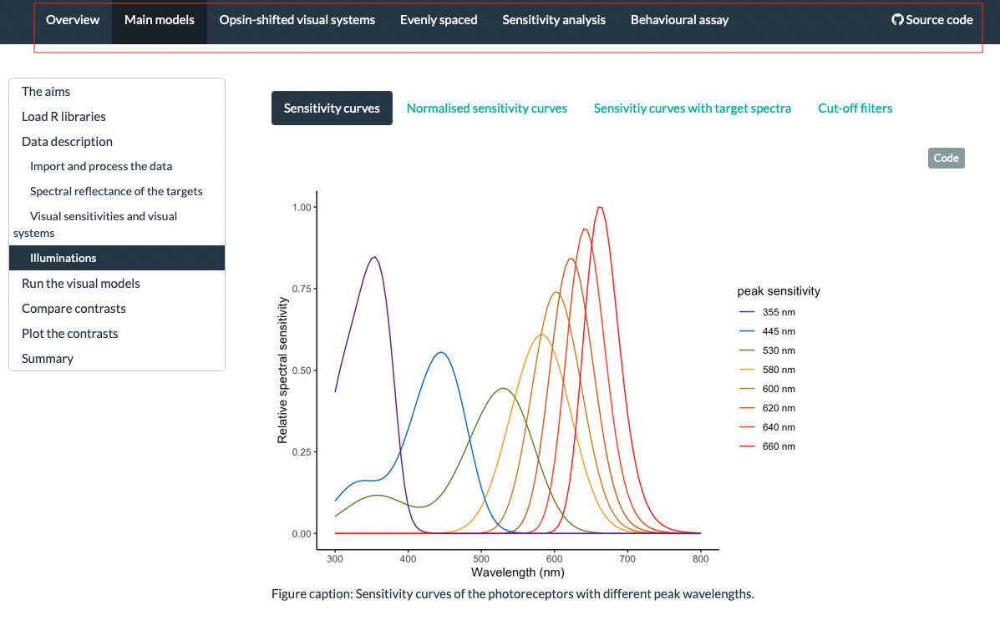
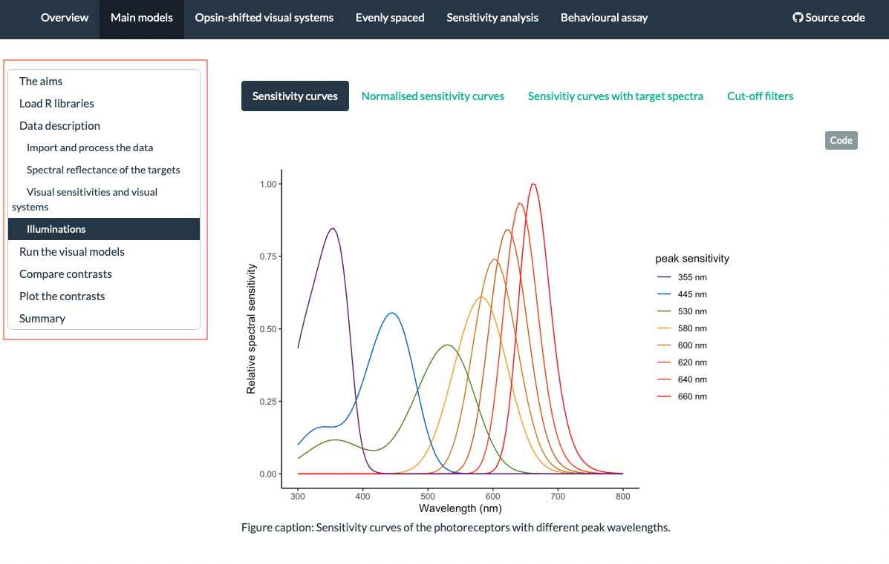
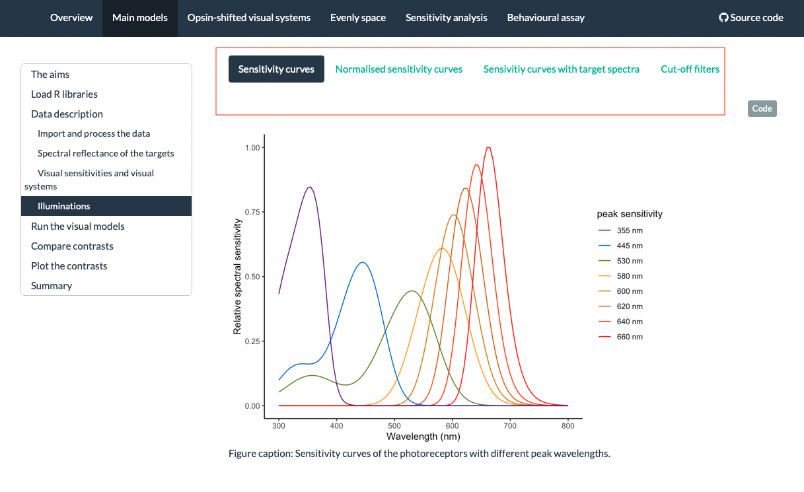
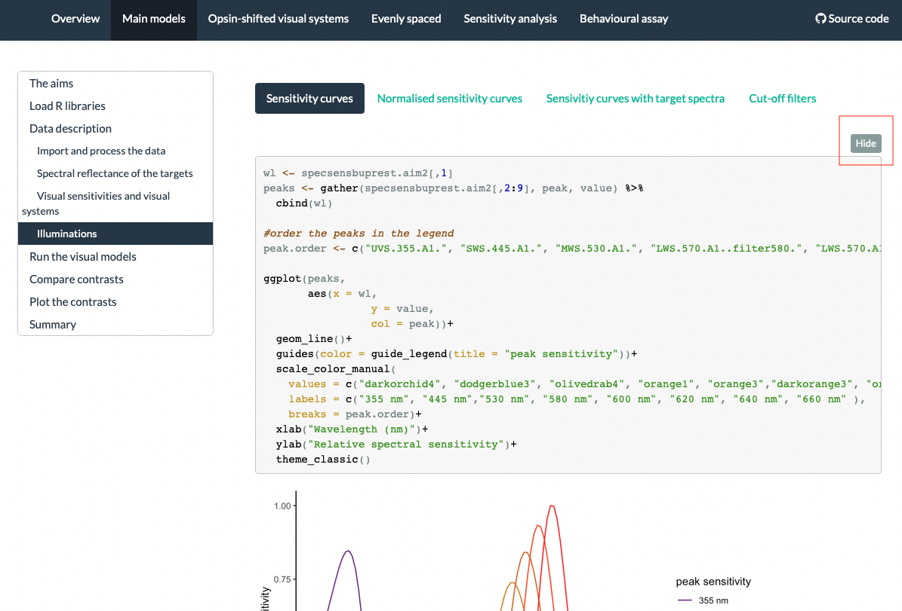

Workshop 2 - RMarkdown

# The aim 

We want to present the results and the visuals in ways that are easier to share with people. We will knit the RMarkdown file into a PDF or a the webpage, so people can have all the info in one place together (with the code if it is a webpage).

We will create a webpage using RMarkdown and publish it as a GitHub page.

example 1 - [Visual models](https://luyiwangtw.github.io/LongWavelengthSensitivity/)

example 2 - [Heating rate](https://lospinarozo.github.io/PrettyCoolBeetlesCodeAndData/)

# Details {.tabset .tabset-fade .tabset-pills}

Let's take a closer look what we can have in a webpage.

## 1. Header 
```{r, echo = FALSE, out.width = '100%'}

```

## 2. Table
```{r, echo = FALSE, out.width = '100%'}

```

## 3. Tabs
```{r, echo = FALSE, out.width = '100%'}

```

## 4. Code button
```{r, echo = FALSE, out.width = '100%'}

```

# Structure and Essentials

As we have mentioned in the last workshop (or not), we suggest you to have some folders to keep everything tidy.

* data: your data
* scripts: for the scripts, including .R and .Rmd files
* docs: for the output
* images (optional): for the images 


## Files 
There are two files you must have to publish a webpage:

1. index.html: default homepage
2. _site.yml:  provides the global YAML header for the site


<span style="color: #FF8F00">*Exercise 1* <br>
Download the template from Bug of the week repo.


## YAML header 

yaml header controls the overall appearance of the page.<br>
_See [here](https://stats.oarc.ucla.edu/stat/data/rmarkdown/rmarkdown_seminar_flat.html#elements-of-an-r-markdown-file---yaml-header) and [here](https://stats.oarc.ucla.edu/stat/data/rmarkdown/rmarkdown_seminar_flat.html#yaml-header) for more details about yaml._


